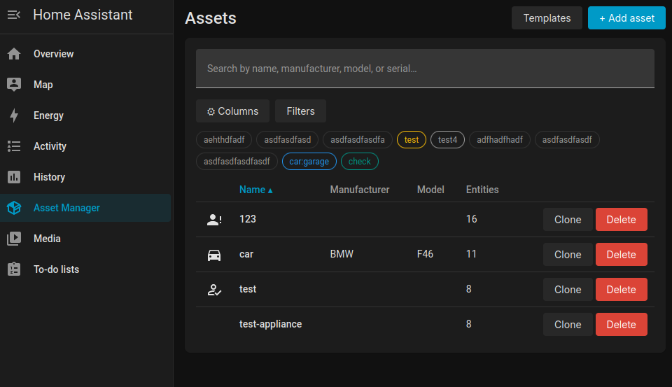
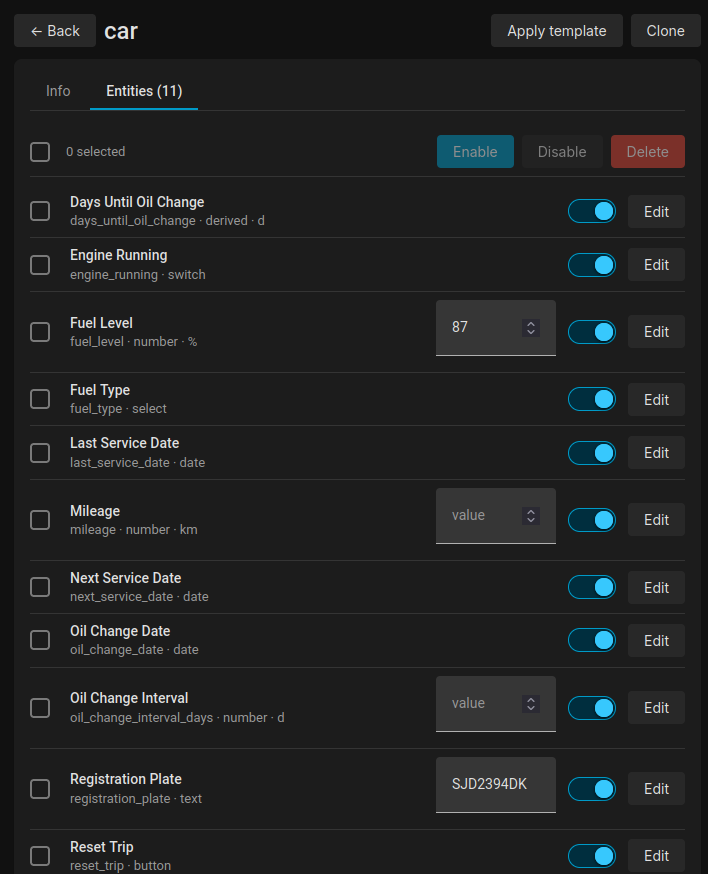
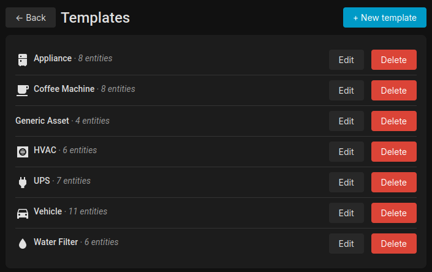
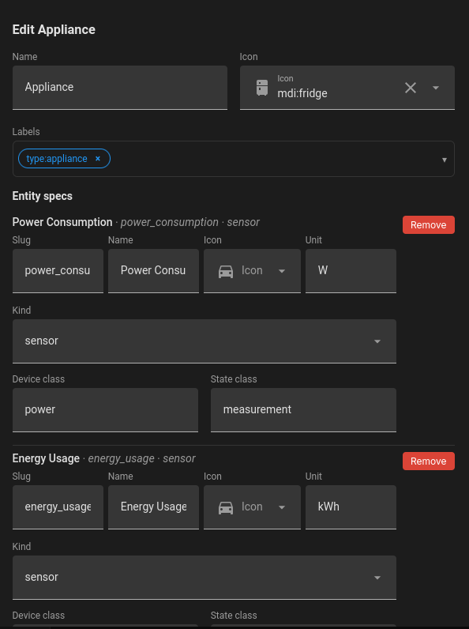

# Asset Manager for Home Assistant

[![GitHub Release][releases-shield]][releases]
[![Project Maintenance][maintenance-shield]][user_profile]

Turn any physical asset — a vehicle, a piece of equipment, a storage
shelf — into a first-class Home Assistant **device** with the entities
you define. No YAML, no helpers: everything is driven from a Settings
panel. Build an asset from scratch, apply reusable templates, clone
existing assets, and derive new sensors from formulas — all from the
UI.

## Features

- **Assets as HA devices** — each asset gets a Device Registry entry
  with manufacturer, model, serial, icon, and HA labels.
- **User-defined entities** — attach number, sensor, date, text,
  select, button, and switch entities to any asset. Configurable per
  kind: min/max/step/mode for numbers, options for selects,
  device_class/state_class for sensors, and more.
- **Templates** — create reusable entity blueprints and apply them to
  new assets in one click. Ships with bundled presets (Vehicle,
  Battery, Generic Sensor, etc.). Templates can carry their own icon
  and labels.
- **Clone** — duplicate an existing asset (including its labels) and
  give the copy a new name. Great for fleet tracking.
- **Derived sensors** — define a sensor whose value is a formula over
  other entities on the same asset (e.g. `days_until_oil_change`).
  The formula is evaluated safely (no `eval`); recalculation is
  event-driven plus a midnight tick for date-based math.
- **Native HA labels** — assets use HA's built-in label registry for
  grouping and filtering. Filter the asset list by label, area,
  manufacturer, model, entity count, or icon.
- **Native HA form elements** — the panel uses HA's own Material
  form controls (`ha-input`, `ha-select`, `ha-textarea`,
  `ha-icon-picker`) with automatic fallback on older HA builds.
- **Live updates** — the panel subscribes to the integration's
  storage collections; changes from any client (browser, another tab,
  automation) appear instantly.

## Screenshots

### Assets list


### Asset detail — entities


### Templates list


### Template editor


## Prerequisites

- Home Assistant **2026.2** or newer
- The **Panel** integration is bundled with HA (no extra setup)

## Installation

### HACS (Custom Repository)

1. Install [HACS][hacs-download] if you don't have it yet
2. In HACS, go to **Integrations → ⋮ → Custom Repositories**
3. Add `https://github.com/illmouse/homeassistant-asset-manager` as
   an **Integration** repository
4. Search for `Asset Manager` in HACS and click **Download**
5. Restart Home Assistant

### Manual

1. Download or clone this repository
2. Copy the `custom_components/asset_manager/` directory to your HA
   config:
   ```
   /config/custom_components/asset_manager/
   ```
3. Restart Home Assistant

## Configuration

[![Add Integration][add-integration-badge]][add-integration]

1. Click the button above, or go to **Settings → Devices & Services →
   Add Integration**
2. Search for **"Asset Manager"**
3. Click **Submit** — no options needed; the integration creates a
   single config entry and opens its panel

Only one Asset Manager instance is allowed (it manages a global
collection of assets).

## Using the panel

After setup, open the **Asset Manager** panel in HA's sidebar.

### Create an asset

1. Click **+ Add asset**
2. Enter a name; optionally pick an icon, an area, HA labels, and a
   template to seed entities from
3. Click **Create** — the asset appears in the list and in the Device
   Registry

### Edit entities

1. Click an asset row (or its name) to open the detail view
2. Under **Entities**, click **+ Add entity** or edit an existing one
3. Choose a kind (number, sensor, date, text, select, button, switch,
   derived), set its config, and save

### Templates

1. Open the **Templates** tab
2. Click **+ New template** (or edit an existing one)
3. Define entity specs just like on an asset — these are applied to
   any asset that uses the template
4. When creating an asset, pick a template to prefill its entities,
   icon, and labels

### Clone

On any asset row, click **Clone**, give the copy a name, and a new
asset is created with the same entities and labels.

## Entity kinds

| Kind | HA platform | Config |
|---|---|---|
| `number` | `number` | min, max, step, mode (box/slider) |
| `sensor` | `sensor` | device_class, state_class |
| `date` | `date` | — |
| `text` | `text` | min, max, pattern |
| `select` | `select` | options |
| `button` | `button` | — |
| `switch` | `switch` | — |
| `derived` | `sensor` | formula, device_class, state_class |

Derived sensors evaluate a formula referencing other entities on the
**same asset** by their slug. The formula engine supports arithmetic,
comparison, and date functions — no `eval`, no arbitrary code.

## Backup & data location

All Asset Manager data is stored in HA's `.storage/` directory under:

```
/config/.storage/asset_manager/
├── assets       # asset records
├── entities     # entity definitions
└── templates    # template blueprints
```

These files are included in HA's normal snapshot/backup. There is no
external database or cloud dependency.

## Troubleshooting

Enable debug logging:

[![Logging service][ha-service-badge]][ha-service]

On the entry page, paste:

```yaml
service: logger.set_level
data:
  custom_components.asset_manager: debug
```

Then check the logs:

[![Home Assistant Logs][ha-logs-badge]][ha-logs]

## Removing the integration

1. Go to **Settings → Devices & Services**
2. Click the three-dot menu on the Asset Manager card → **Delete**
3. All assets, entities, and the panel are removed automatically.
   Template and asset data in `.storage/asset_manager/` is deleted on
   removal.

## Files

```
custom_components/asset_manager/
├── __init__.py            # Setup, coordinator, platform dispatch
├── manifest.json          # Integration metadata
├── config_flow.py         # Single-instance config flow
├── const.py               # Constants
├── models.py              # Asset / EntityDef / Template dataclasses + schemas
├── storage.py             # StorageCollection-backed CRUD
├── coordinator.py         # Device + entity registry reconciliation
├── entity.py              # Entity platform factory + AssetEntity base
├── derived.py             # Derived sensor evaluator + midnight tick
├── formula.py             # Safe formula parser (no eval)
├── ws.py                  # WebSocket CRUD + clone/apply/derive commands
├── panel.py               # Serves frontend + registers sidebar panel
├── number.py date.py sensor.py select.py button.py switch.py text.py
└── frontend/              # ES module panel (no build step)
    ├── asset-manager-panel.js   # Entry: custom element + routing
    ├── constants.js             # Domain, entity kinds, label colors
    ├── dom.js                   # h() hyperscript helper
    ├── native-fields.js         # ha-input/ha-select/ha-textarea wrappers
    ├── ws.js                    # WebSocket CRUD + subscribe
    ├── styles.js                # Panel styles
    ├── ui.js                    # Toast, confirm, modal, busy helpers
    ├── config-fields.js         # Kind-aware entity config editor
    ├── pickers.js               # Icon + area pickers
    ├── labelPicker.js           # Multi-select label combobox
    ├── dialogs.js               # Asset/clone/entity/template dialogs
    └── views.js                 # List / detail / templates views
```

## License

MIT — see [LICENSE](LICENSE).

[add-integration]: https://my.home-assistant.io/redirect/config_flow_start/?domain=asset_manager
[add-integration-badge]: https://my.home-assistant.io/badges/config_flow_start.svg
[hacs-download]: https://hacs.xyz/docs/setup/download
[ha-logs]: https://my.home-assistant.io/redirect/logs
[ha-logs-badge]: https://my.home-assistant.io/badges/logs.svg
[ha-service]: https://my.home-assistant.io/redirect/developer_call_service/?service=logger.set_level
[ha-service-badge]: https://my.home-assistant.io/badges/developer_call_service.svg
[maintenance-shield]: https://img.shields.io/badge/maintained-yes-green.svg?style=flat
[releases-shield]: https://img.shields.io/github/release/illmouse/homeassistant-asset-manager.svg?style=flat
[releases]: https://github.com/illmouse/homeassistant-asset-manager/releases
[user_profile]: https://github.com/illmouse